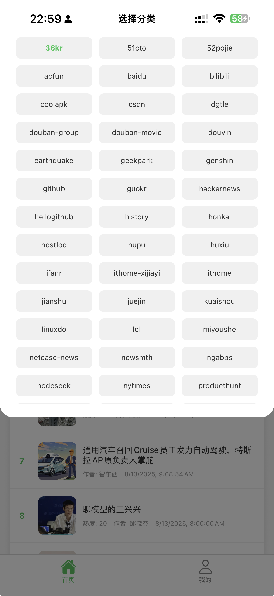

# 热榜 App (hot-list-app)

这是一个使用 React Native 和 Expo 构建的移动应用程序，用于展示热门信息列表。

## ✨ 功能特性

- **热门列表**: 从 API 获取并展示一个热点新闻或话题列表。
- **跨平台**: 基于 Expo 和 React Native，可同时为 iOS 和 Android 构建。

## 📷 一些截图





## 🚀 快速开始

在开始之前，请确保您已经安装了 [Node.js](https://nodejs.org/) 和 [Expo CLI](https://docs.expo.dev/get-started/installation/)。

1.  **克隆仓库**
    ```bash
    git clone https://github.com/alterem/hot-list-app.git
    cd hot-list-app
    ```

2.  **安装依赖**
    ```bash
    pnpm install
    ```

3.  **启动应用**
    ```bash
    pnpm start
    ```
    或者，您可以针对特定平台运行：
    ```bash
    pnpm run ios
    pnpm run android
    ```
    启动后，Expo DevTools 会在您的浏览器中打开。您可以使用 Expo Go 应用扫描二维码，在您的手机上运行此应用。

## 📂 项目结构

```
.
├───assets/              # 静态资源，如图片和图标
├───src/
│   ├───components/      # 可重用的 UI 组件
│   ├───config/          # 配置文件，如 API 地址
│   ├───screens/         # 应用的主要屏幕组件
│   │   ├───HomeScreen.tsx     # 首页（热榜列表）
│   │   ├───ProfileScreen.tsx  # 个人中心页面
│   │   └───WebViewScreen.tsx  # 用于显示网页内容的屏幕
│   ├───types/           # TypeScript 类型定义
│   └───utils/           # 工具函数
├───App.tsx              # 应用主入口和导航设置
├───package.json         # 项目依赖和脚本
└───tsconfig.json        # TypeScript 配置文件
```

## 🛠️ 主要技术栈

- [React Native](https://reactnative.dev/)
- [Expo](https://expo.dev/)
- [React Navigation](https://reactnavigation.org/)
- [TypeScript](https://www.typescriptlang.org/)
- [Expo Vector Icons](https://docs.expo.dev/guides/icons/)
- [React Native WebView](https://github.com/react-native-webview/react-native-webview)
